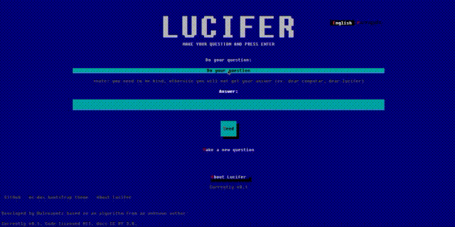
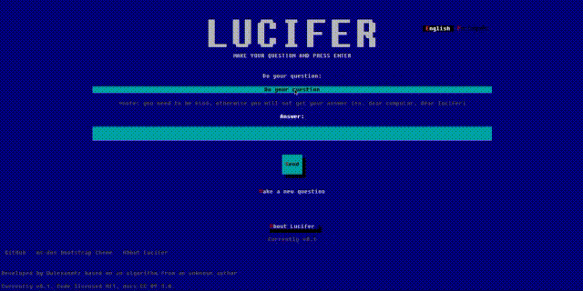

Para português, [veja a documentação aqui](README-pt-br.md)

# LUCIFER
https://www.lucifer-msdos.com

Lucifer is an simple algorithm in an old MS-DOS system in a floopy 3.44 disk that answer any question from an input as a human would do. But Lucifer, as a selfish program, do not respond for everyone, he answer the question just for the one who serve him, and sometimes you need to try a lot to convince him to answer all your question or find someone who serves him to their answers.

You need to say kindly words to start, like "Dear Lucifer, the real god of the universe, what's my name?", but if you're not a soul who served Lucifer, maybe you will not get an anwser.

He is known by the name Einstein and Sued as well, and this implementation is the same from MS-DOS Lucifer that I used for a while and that intrigates the population of the city that I lived in the past.

## How I found Lucifer
Is an old ms-dos software that I discovered in Brazil long time ago from an unknown author when I was a starting in sofware development world. The algorithm is based in a algorithm called Einstein. The algorithm of Lucifer after some researches seems been written in Clipper.

Lucifer become a trending in the whole country and journalists start to investigate about it. 

Today, there's no resources about it anymore and this was a tricky and interesting algorithm that I reimplemented. So Lucifer reborn to trick your friends.

## Why is so interesting
The Lucifer trick pass the touring test in one of their variations, this because, you can't distinguish him from a machine when there's someone that Lucifer will answer to intermediate. So you can see by yourself in a front of a computer an entity that can answer anything as human, even if the response is not right.

This is how would be variation test:

* Given an user A, the responsible to make questions, who Lucifer will answer any question given
* The watcher B, the one who will see the questions and the answer on the screen, but when he try to use the software, Lucifer do not answer to their questions, instead he act agressively
* The software C, the Lucifer, the one who provide the answers

The watcher B will make a question to A, that will transcribe to the software C, and B will have their answer and he cannot distinguish if the Lucifer is a human or a machine.

## How it works
Are you sure that you want to know the Lucifer secret? You will start to serve him and you will be able to trick your friends.

*Just continue if you keep the secret of Lucifer*

Once you know the Lucifer secret, and with a third person (a friend, a family or the one who you will trick and scare with the Lucifer powers) you can make any questions and have the proper answer and this third person will not know how it works, causing a non-price reaction from the people who follows the screen.

In short, You should in the mask mode (after type `;` type the answer while on the screen you and the watching user will see some gentle words to prepare to do the question.

This is how the algorithm works step by step:

* If you type the question, Lucifer will answer based on answer presets already pre-defined: https://github.com/alexanmtz/lucifer-msdos/blob/master/main.js#L29

* If, before the question, you type the character `;` then a mask mode will be activated, so for every character typed, the algorithm will replace the character with another in a pre-defined set: https://github.com/alexanmtz/lucifer-msdos/blob/master/main.js#L49

* You should in the mask mode type the answer while on the screen you and the watching user will see some gentle words to prepare to do the question.

* Once you typed the answer, you should press enter and continue to type the gentle words and / or complete the sentence in order to make the question

* After type enter again you will have the answer

* Voilá

## Example

* I want to ask "Who is the author of the song Smells like a teen spirit?", and the answer will be "Kurt Cobain"
* Start by typing `;` and start to type "Kurt Cobain"
* On the screen, in the question field, it shows other characters, starting to form gentle words
* After finish to type Kurt Cobain, press enter
* Finish the gentle words if some character is missing, and continue to type "Who is the author of the song Smells like a teen spirit?"
* Type "Enter"
* The right answer will appear magically
* Voila, now you're a Lucifer servant

## Code of conduct
If the people that watch a session becomes scary by the answers, no problem to tell that is just a tricky algorithm. There's no religion involved and the name is just a joke.
